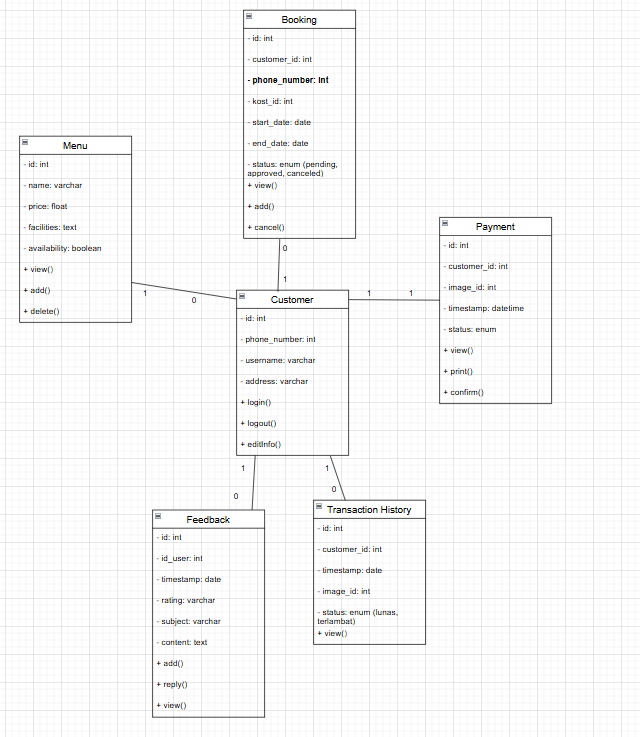
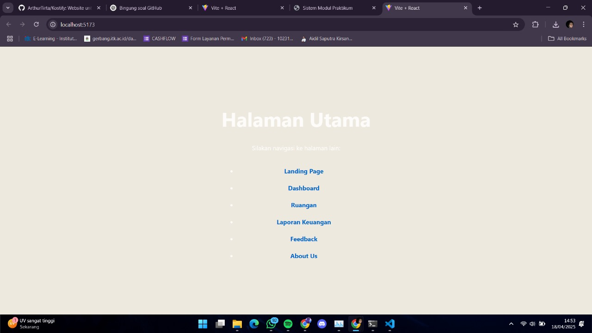
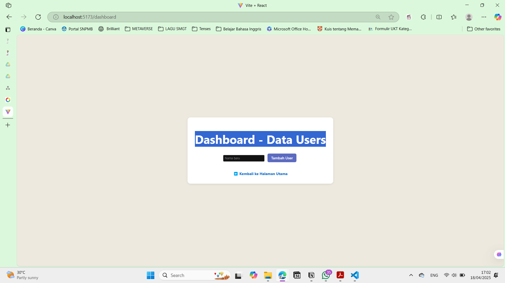
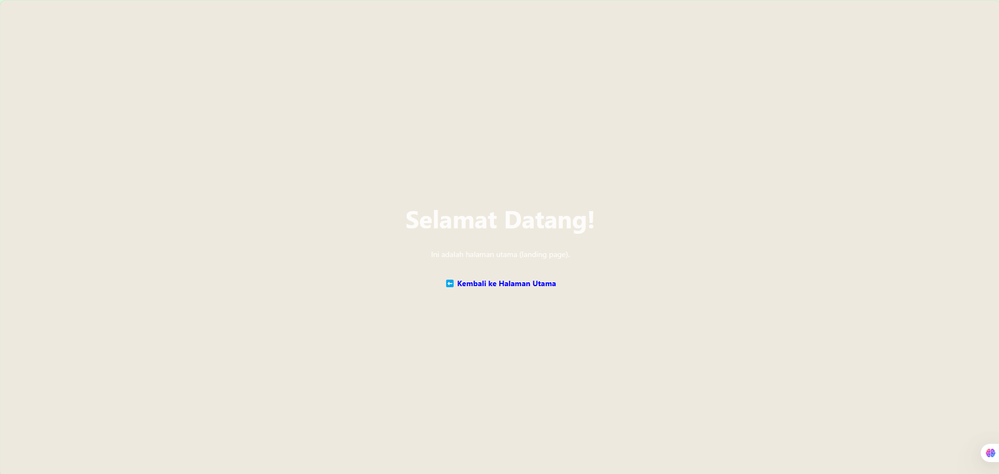
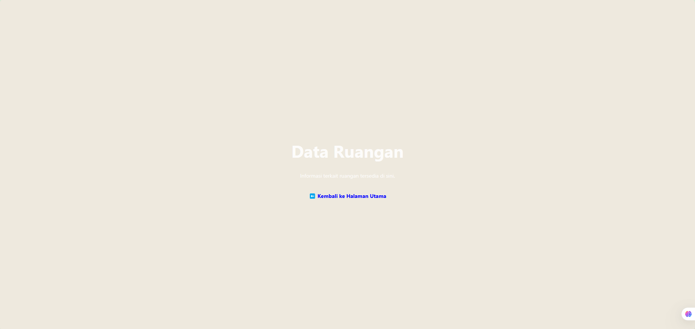
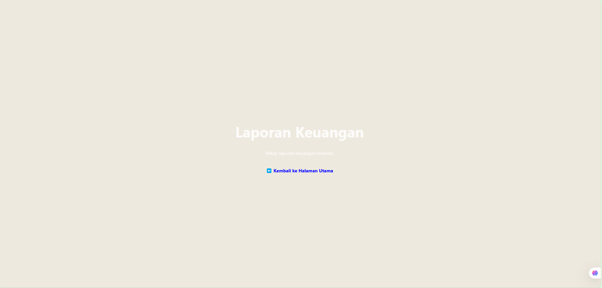
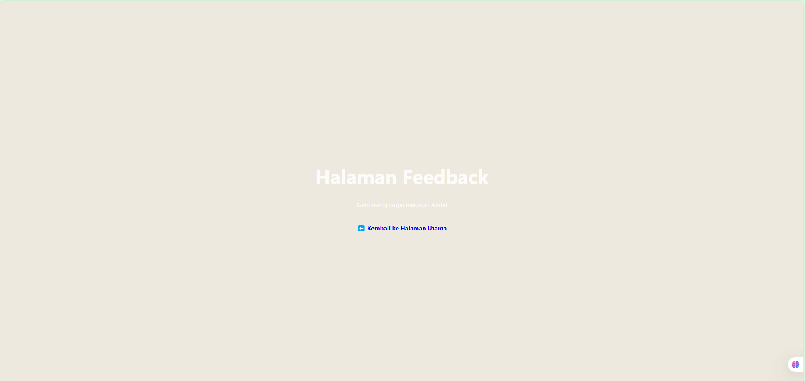
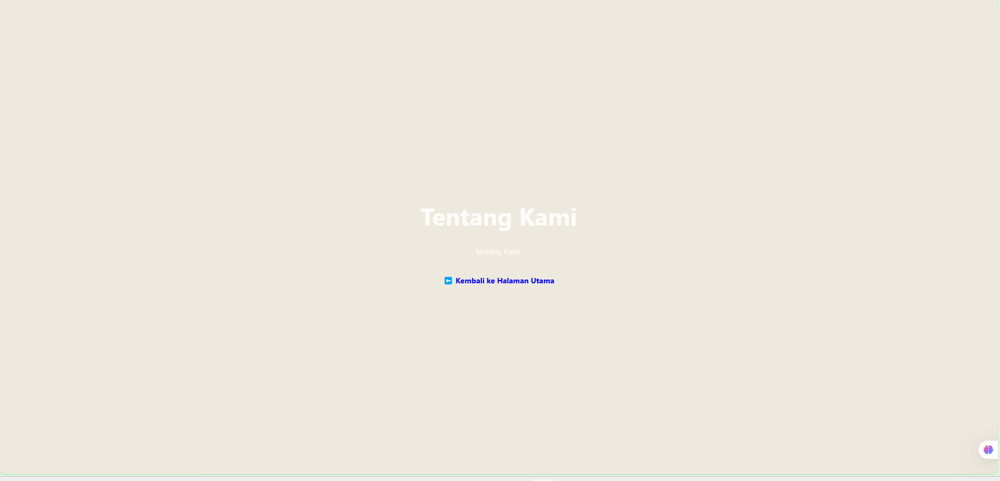

# Laporan Progres Mingguan - Kostify
**Kelompok**: 2  
**Mitra**: Solata Kos  
**Pekan ke-**: 10  
**Tanggal**: 18/04/2025  

## Progress Summary
Implementasi awal database dan frontend/backend untuk mendukung kebutuhan bisnis kos-kosan Solata Kos.  

## Accomplished Tasks

- Merancang Skema Database

- REST API
```
Backend dikembangkan menggunakan Express.js. Beberapa endpoint dasar yang sudah dibuat:

GET / - Menampilkan teks "Hello from Express"

GET /users - Mengambil seluruh data user

GET /users/:id - Mengambil user berdasarkan ID

POST /users - Menambahkan user baru

PUT /users/:id - Mengganti seluruh data user berdasarkan ID

PATCH /users/:id - Mengubah sebagian data user

DELETE /users/:id - Menghapus user berdasarkan ID
```
- Menyiapkan Struktur Frontend Basic
```
Struktur Frontend sudah terbentuk sebagai berikut:

kostify-frontend/
|--- public/
|--- src/
|   |--- assets/
|   |--- App.css
|   |--- App.jxs
|   |--- about.jxs
|   |--- dashboard.jsx
|   |--- feedback.jsx
|   |--- index.css
|   |--- landing.jsx
|   |--- laporan.jsx
|   |--- main.jsx
|   |--- ruangan.jsx
|--- package-lock.json
|--- package.json
|--- README.md
|--- vite.config.js
```
- Menyiapkan Struktur Backend Basic
```
Struktur Frontend sudah terbentuk sebagai berikut:

kostify-backend/
|--- index.js
|--- package-lock.json
|--- package.json
``
- Demo Progress ke Mitra
```
Kami telah melakukan progress awal kepada mitra sebagai berikut:

- Penjelasan alur aplikasi dari frontend ke backend
- Demo aplikasi melalui UI/UX Design dengan Figma
- Menerima feedback dan saran terkait fitur apa yang perlu dikembangkan


## Challenges & Solutions
-

## Next Week Plan
- Task 1 Membangun sistem autentikasi
- Task 2 Mengimplementasikan Fitur Dashboard


## Contributions
- **Arthur Tirtajaya Jehuda**: Monitor Anggota, Diskusi dengan Mitra.
- **Muhammad Athala Romero**: Menyiapkan struktur proyek backend
- **Rizki Abdul Aziz**: Testing fitur  
- **Yosan Pratiwi**: Routing Frontend
## Screenshots / Demo
Pada minggu 10 Proyek mencapai bentuk prototype






