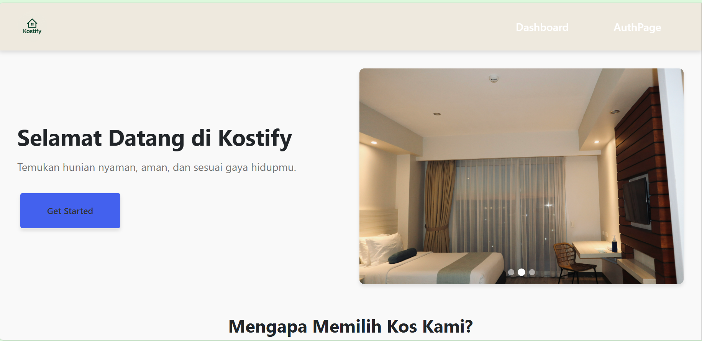
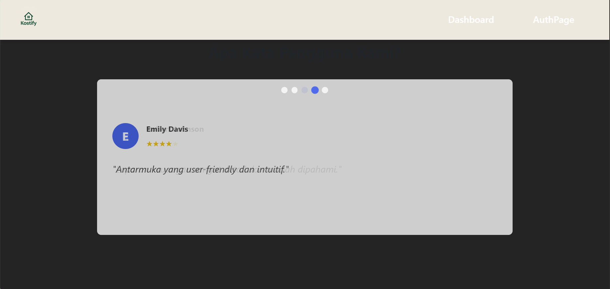
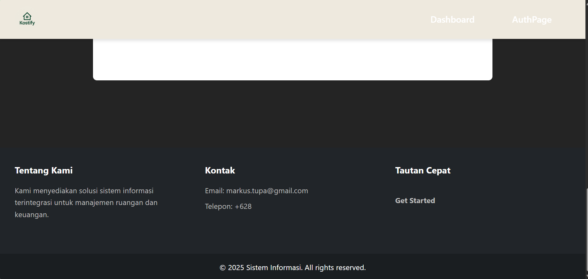
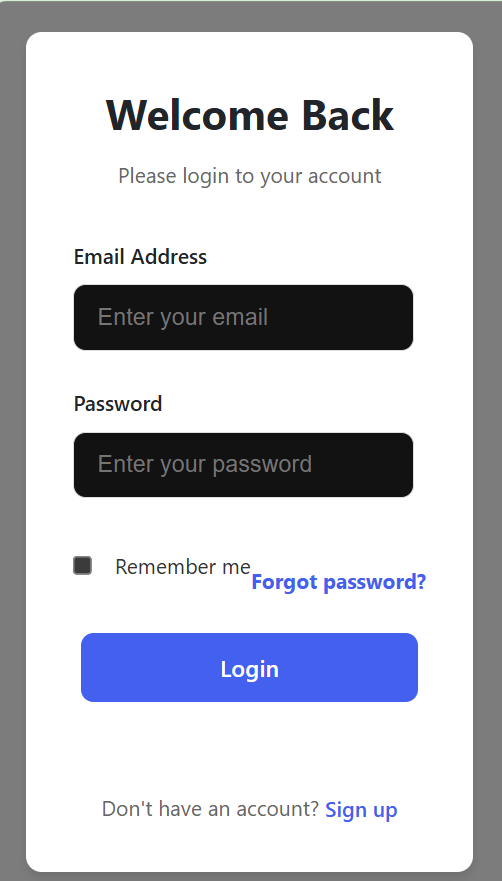
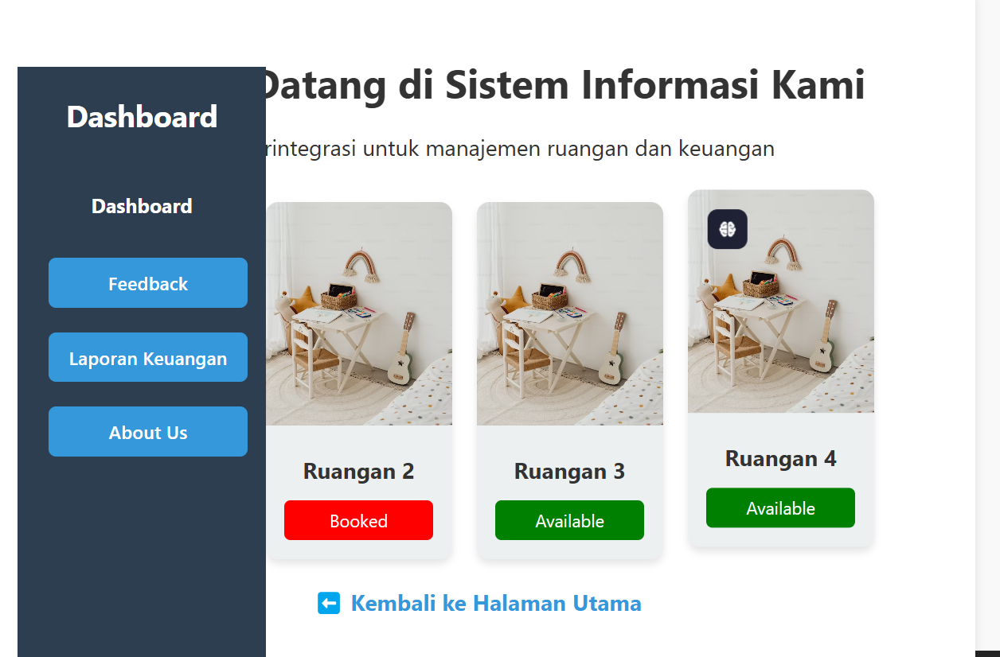

# Laporan Progres Mingguan - Kostify
**Kelompok**: 2  
**Mitra**: Solata Kos  
**Pekan ke-**: 11  
**Tanggal**: 25/04/2025  
**Anggota Kelompok**:
- Arthur Tirtajaya Jehuda -10231019
- Muhammad Athala Romero - 10231059
- Rizki Abdul Aziz - 10231085
- Yosan Pratiwi - 10231091
## Progress Summary
Implementasi autentikasi perbaikan dan penambahan user interface.  

## Accomplished Tasks

- Perbaikan User Interface




Implementasi Autentikasi
- Backend 
Endpoint Autentikasi 
Register 
```
router.post('/register', async (req, res) => {
  const { username, password, role } = req.body;
  if (!['admin', 'penyewa'].includes(role)) {
    return res.status(400).json({ error: 'Role tidak valid' });
  }

  const hashed = await bcrypt.hash(password, 10);
  try {
    const result = await pool.query(
      'INSERT INTO users (username, password, role) VALUES ($1, $2, $3) RETURNING *',
      [username, hashed, role]
    );
    res.json({ message: 'User berhasil didaftarkan', user: result.rows[0] });
  } catch (err) {
    res.status(500).json({ error: err.message });
  }
});
```
Login
```
router.post('/login', async (req, res) => {
  const { username, password } = req.body;
  try {
    const result = await pool.query('SELECT * FROM users WHERE username = $1', [username]);
    if (result.rows.length === 0) return res.status(400).json({ error: 'User tidak ditemukan' });

    const user = result.rows[0];
    const match = await bcrypt.compare(password, user.password);
    if (!match) return res.status(401).json({ error: 'Password salah' });

    res.json({ message: 'Login berhasil', user: { id: user.id, username: user.username, role: user.role } });
  } catch (err) {
    res.status(500).json({ error: err.message });
  }
});
```
- Frontend
User Interface Autentikasi 




- Demo Progress ke Mitra

Kami telah melakukan bincang kepada mitra sebagai berikut:

- Demo aplikasi melalui UI/UX Design dengan Figma
- Menerima feedback dan saran terkait fitur apa yang perlu dikembangkan


## Challenges & Solutions
- **Challenge 1**: Kendala tidak dapat menemukan waktu luang mitra
  - **Solution**: Menentukan jadwal mitra jauh-jauh hari.
- **Challenge 2**: Anggota slow respon, susah komunikasi
  - **Solution**: Melakukan interaksi offline.
-
## Next Week Plan
- Task 1 Mengembangkan fitur Kelola Pembayaran 
- Task 1 Mengembangkan fitur Feedbaack
- Task 3 Menulis Unit Test 

## Contributions
- **Arthur Tirtajaya Jehuda**: Monitor Anggota, Diskusi dengan Mitra, mengembangkan landing page.
- **Muhammad Athala Romero**: Membuat endpoint autentikasi 
- **Rizki Abdul Aziz**: Memantau pengembangan.  
- **Yosan Pratiwi**: Mengembangkan User Interface Dashboard
## Screenshots / Demo
Pada minggu 10 Proyek mencapai bentuk prototype seperti berikut

### Landing Page


### Dashboard
