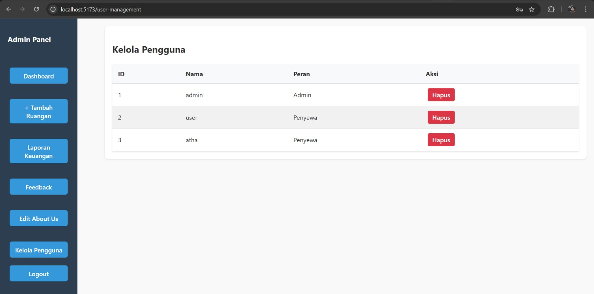
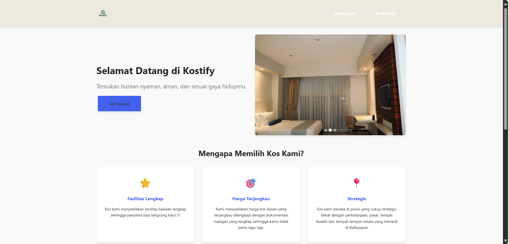
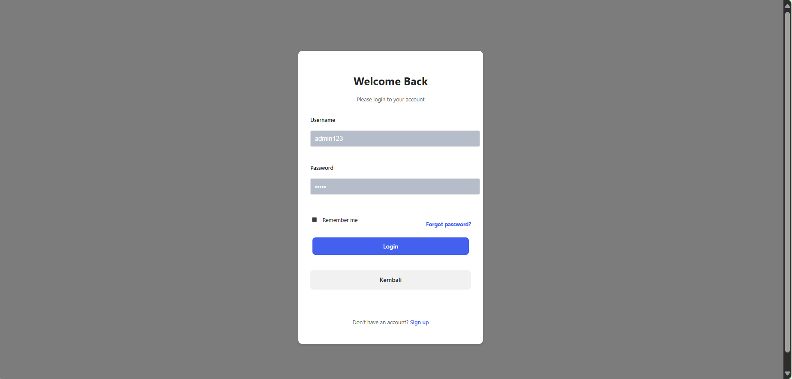
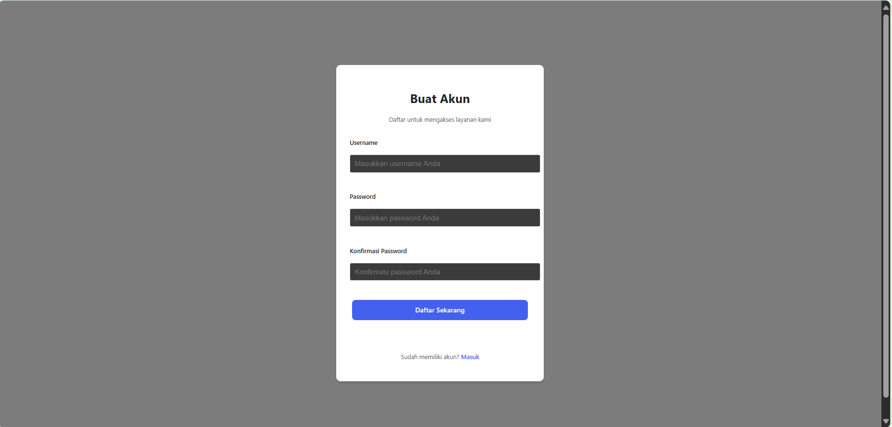
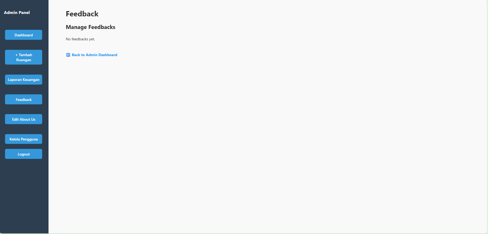
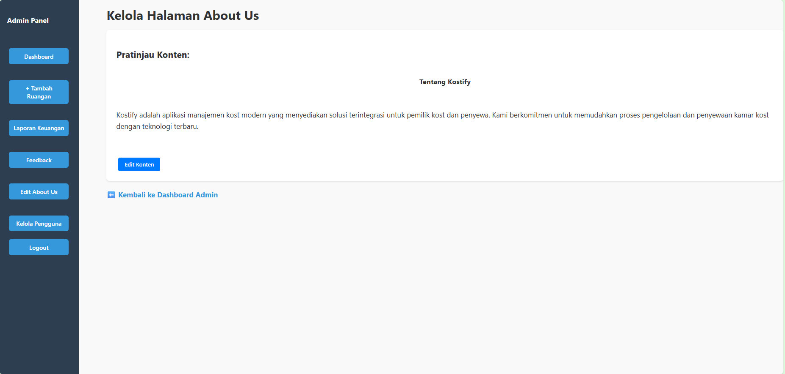

# Laporan Progres Mingguan - Kostify
**Kelompok**: 2  
**Mitra**: Solata Kos  
**Pekan ke-**: 14  
**Tanggal**: 16/05/2025  

**Anggota Kelompok**:
- Arthur Tirtajaya Jehuda -10231019
- Muhammad Athala Romero - 10231059
- Rizki Abdul Aziz - 10231085
- Yosan Pratiwi - 10231091
## Progress Summary
Mengembangkan laporan keuangan dan kelola pengguna di sisi admin dalam backend serta pengujian.  

## Accomplished Tasks

#### Unit Test
Unit test adalah proses pengujian terhadap kode program, seperti fungsi atau metode, untuk memastikan bahwa setiap bagian kode bekerja sesuai dengan yang diharapkan. Pengujian ini penting karena membantu mendeteksi kesalahan, terutama pada fitur inti (core feature) sistem yang sangat krusial. Dengan unit test, pengembang dapat memastikan fungsi-fungsi utama berjalan stabil, mencegah bug menyebar saat kode diperbarui, dan mempermudah proses evaluasi serta pemeliharaan perangkat lunak.

- authpage

dibagian login page ini, tampilan belum maksimal dan masih perlu peningkatan seperti visual, color palette, dan ketentuan password (minimal 8-10 huruf, terdapat huruf besar, angka, dan simbol). 5

- dashboard

pada bagian dashboard terdapat tampilan kamar/ruangan kos yang tersedia pada kostify. namun yang tampil di halaman pengguna dan admin sama. mungkin bisa lebih baik pada halaman admin dibuat seluruh kamar tapi ketika ingin ditampilkan di halaman pengguna, admin tinggal mengchecklist kamar mana saja yang ingin ditampilkan di halaman pengguna. sehingga admin tidak perlu harus menambah/menghapus ruangan setiap saat, cukup ketika ada kamar baru ataupun karena satu dan lain hal. lalu juga terdapat status pada kamar yang tampil di halaman pengguna, apakah kosong, dipesan, ataupun sudah terisi.

- feedback

di halaman feedback ini hanya terdapat fitur read belum ada yang lainnya sehingga masih dalam proses peningkatan. juga mungkin pada visual review bisa dibuat lebih baik dengan menambahkan sedikit elemen elemen yang berkaitan agar terlihat fresh dan menarik.

- laporan keuangan

di halaman ini masih belum menampilkan laporan keuangan juga pada halaman admin fitur crud belum ada karena masih dalam tahap pengerjaan.

- about us

di halaman ini juga masih belum menampilkan "about us" karena kode tidak bisa dijalankan dan masih dalam proses perbaikan.

#### Pengembangan Laporan Keuangan

- Dapat menambah laporan keuangan
- Dapat menghapus laporan keuangan
- Dapat edit laporan keuangan

konfirmasi

- Dapat melihat laporan keuangan

- Kelola Pengguna

Sebelum delete  

Sesudah delete

## Challenges & Solutions
- **Challenge 1**: Waktu Progres Backend yang terlalu lama karena kurang tepat menjadwalkan.
  - **Solution**: Menerapkan waktu penjadwalan lebih tepat lagi.
-
## Next Week Plan
- Task 1 Mengembangkan fitur Kelola Pembayaran 
- Task 2 Mengembangkan fitur kelola penggua
- Task 3 Mengembangkan fitur About Us
- Task 4 Mengembangkan Visualisasi Data

## Contributions
- **Arthur Tirtajaya Jehuda**: Monitor Anggota, Diskusi dengan Mitra, mengembangkan Dashboard.
- **Muhammad Athala Romero**: mengerjakan CRUD Laporan Pembayaran dan kelola pengguna
- **Rizki Abdul Aziz**:  menguji sistem, mengembangkan tampilan about us  .  
- **Yosan Pratiwi**: Mengembangkan User Interface Feedback
## Screenshots / Demo
Pada minggu 14 Proyek mencapai bentuk prototype seperti berikut

- Landing Page
 
- Login

- Register

- Dashboard Admin

- Lihat Kamar

- Pemesanan Kamar

- Laporan Keuangan
 
- Form Edit Laporan Keuangan

- Feedback

- About Us 

