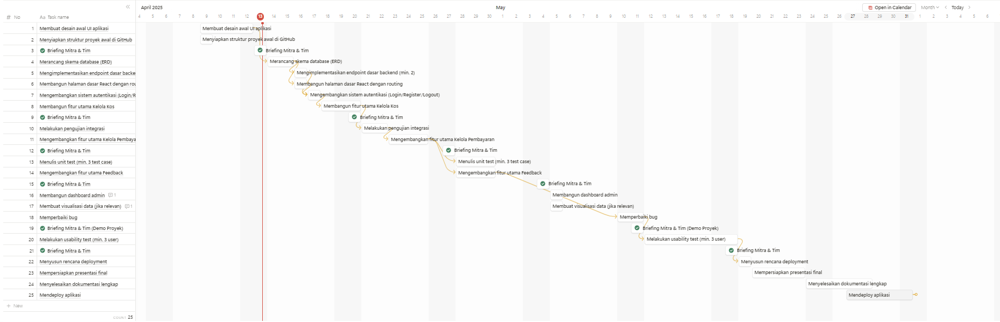
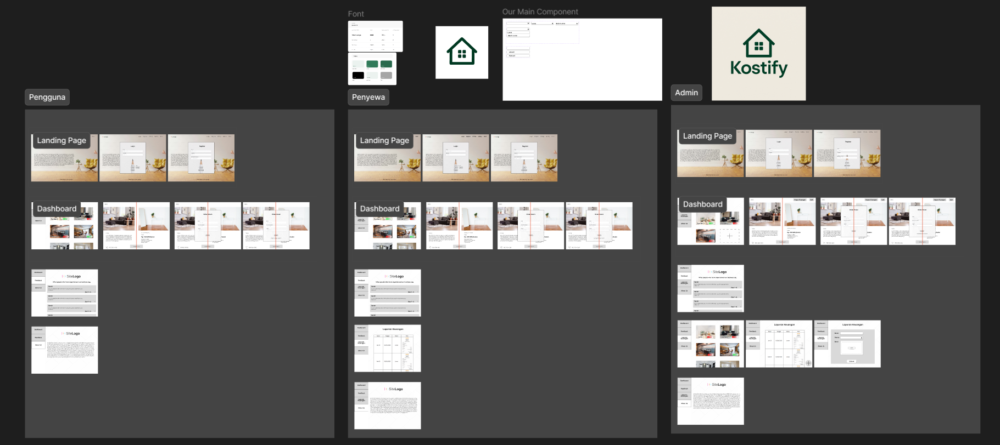

# Laporan Progres Mingguan - Kostify
**Kelompok**: 2 \
**Mitra**: Solata Kos\
**Pekan ke-**: 9\
**Tanggal**: 13/04/2025

## Progress Summary
Perencaanaan & Inisiasi Projek

## Accomplished Tasks
- Diskusi dengan mitra
```
Apa bisnis yang dijalankan saat ini ?
kost-kostan

Apa kendala bisnis saat ini ?
Akhir-akhir ini sudah sedikit orang yang berminat untuk menempati kos-kosan saya, mungkin karena harganya kemahalan dibanding fasilitas atau memang banyak orang yang tidak tau ada kos-kosan saya.
Penyewa telat membayar uang kos.

Bagaimana owner memperkenalkan bisnis sebelumnya ?
Hanya melalui mulut ke mulut atau lewat Whatsapp
Fasilitas bisnis apa aja? dan berapa harganya ?
Hanya disediakan Tandon , 950.000/bulan

Keluhan penyewa ?
Tidak ada supply air bersih, calon penyewa mengharapkan fasilitas tempat tidur, meja makan, lemari. 

Apa ada rencana upgrade bisnis ? Apa saja yang mau di upgrade ?
Ada, Penambah supply air bersih dan pemasangan AC.

Apa kelebihan bisnis ini dari bisnis serupa ?
Ruang tamu luas, dapur luas, teras + halaman luas. bisa parkir mobil, berada di pinggir jalan, bebas banjir, dekat rumah ibadah.
Kekurangan kos kosan
Tidak ada supply air bersih.

Kapan beroperasi ?
Setahun lalu
```
- Deskripsi kebutuhan mitra
```
Solata Kos membutuhkan solusi IT pada bisnis ini yang dapat membawa bisnis ini ke dunia digital. Software diharapkan membantu menjangkau khalayak lebih banyak melalui internet dimana khalayak dapat menelusuri informasi  detail pada hunian sehingga memudahkan khalayak mencari tempat tinggal yang sesuai dengan kebutuhannya juga dapat mengatasi manajemen pembayaran kos yang lebih mudah melalui peran teknologi dengan sifatnya yang dapatnya diakses dimana saja dan kapan saja baik owner atau penyewa.

```
- Fitur-fitur MVP 
```
1. Autentikasi (Login/Logout)
Pengguna, Penyewa, dan Admin bisa masuk dan keluar dengan mudah.

2. Kelola Data Kos
Lihat info kos: Semua orang bisa melihat daftar kos yang tersedia.

Update info kos: Admin/Pemilik bisa memperbarui informasi kos (contoh: harga, fasilitas).

Tambah/hapus kos: Admin/Pemilik bisa menambah kos baru atau menghapus kos yang sudah tidak tersedia.

3. Kelola Pembayaran
Admin bisa menambah/mengedit/menghapus data konfirmasi pembayaran dari penyewa dan dapat dilihat hanya oleh penyewa terkait.

4. Feedback
Admin bisa membaca kritik/saran dari penyewa yang telah merasakan layanan.

```

- Timeline


- Desain Awal Aplikasi

- Membuat struktur proyek awal dengan README

## Challenges & Solutions
- **Challenge 1**: Merancang UI yang familiar agar sesuai dengan mental model pengguna
  - **Solution**: Menggali karakteristik pengguna
- **Challenge 2**: Merancang UX agar tepat dengan kebutuhan pengguna
  - **Solution**: Mengetahui kebutuhan pengguna
- **Challenge 3**: Penggalian fitur apakah fitur adalah hal yang paling dibutuhkan atau hanya sekedar keinginan pengguna sehingga bisa menyebabkan perubahan perencaan kebutuhan mitra
  - **Solution**: Menggali proses bisnis mitra

## Next Week Plan
- Task 1 Merancang Skema Database
- Task 2 Mengimplementasikan endpoint dasar backend
- Task 3 Membangun halaman dasar React dengan routing
-Task 4 Mengembangkan sistem autentikasi (Login/Register/Logout)
-Task 5 Membangun fitur utama Kelola Kos


## Contributions
- **Arthur Tirtajaya Jehuda**: Merancang UI/UX Design, Membuat Timeline, Diskusi dengan Mitra.
- **Muhammad Athala Romero**: Menyiapkan struktur proyek
- **Rizki Abdul Aziz**: Diskusi dengan Mitra, Review UI/UX Design 
- **Yosan Pratiwi**: Diskusi dengan Mitra, Merancang UI/UX Design

## Screenshots / Demo
Pada minggu 9 Proyek mencapai bentuk prototype
